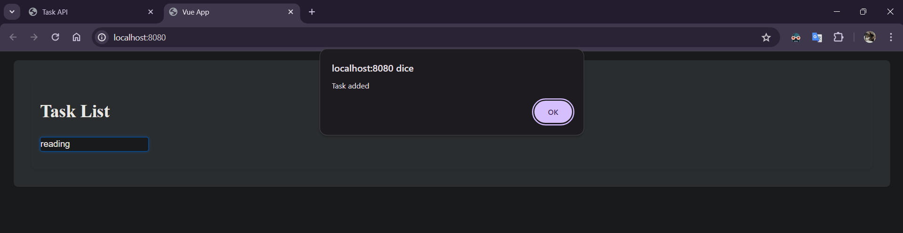

## Documentazione Applicazione Web

**Installazione**

In questa sezione andremo a vedere quali sono i tool utilizzati per poter usare questa semplice applicazione

**Visual Studio Code**

Visual Studio Code è un editor di codice sorgente progettato per essere leggero, veloce e altamente personalizzabile, offrendo agli sviluppatori un'ampia gamma di funzionalità per scrivere, modificare e debuggare codice in diversi linguaggi di programmazione.
Dal seguente link si può installare l’editor: https://code.visualstudio.com/download
Affinché si possa utilizzare l’editor, bisogna realizzare una cartella in cui salvare tutto il lavoro e poi andare nella sezione “Estensioni” e installare: “Pyhon”, “Vue – Official” e “Docker”

**Node.js**

Node.js è un ambiente di runtime open source per eseguire codice JavaScript lato server che consente agli sviluppatori di creare applicazioni di rete scalabili e veloci. Una delle caratteristiche chiave di Node.js è il suo modello di I/O asincrono non bloccante, che consente di gestire numerose richieste simultaneamente senza dover attendere che una richiesta si completi prima di gestire la successiva
Dal seguente link si può installare l’ambiente: https://nodejs.org/en
All’interno di Node.js è incluso anche npm ("Node Package Manager"), utilizzato per installare, condividere e gestire le dipendenze dei progetti JavaScript, facilitando la gestione dei pacchetti e delle dipendenze, oltre a fornire un'infrastruttura per la condivisione del codice e l'automazione dei flussi di lavoro.

**Vue.js**

Vue.js è un framework JavaScript progressivo e open source utilizzato per la creazione di interfacce utente e applicazioni web single-page (SPA). Progettato per essere incrementale e per essere semplice e flessibile, con una sintassi chiara e intuitiva che consente agli sviluppatori di creare componenti riutilizzabili e costruire interfacce utente complesse con facilità.
Dal seguente link: https://cli.vuejs.org/guide/installation.html , si può procedere con l’installazione scrivendo nel prompt dei comandi il seguente comando: “npm install -g @vue/cli”
A fine installazione, andare sulla cartella che abbiamo realizzato prima su Visual Studio Code dal prompt dei comandi con questa dicitura: “cd C:\X\X\X\nome_cartella” e digitare sul prompt: “vue create nome_progetto_vue”, scegliere la versione con “Default ([Vue 3] babel, eslint)” (se dovesse chiedere di scegliere tra Yarn ed NPM, scegliere NPM).
A fine realizzazione del progetto vue, entrare nella cartella con il comando “cd nome_progetto_vue” ed eseguire il comando “npm run serve” che permette di azionare l’istanza di vue.js

**Python**

Python è un linguaggio di programmazione di alto livello, interpretato e compilativo, noto per la sua sintassi chiara e leggibile, che supporta la programmazione Object Oriented, con una tipizzazione dinamica (ovvero non si utilizza la dichiarazione dei tipi per le variabili), con delle funzioni di prima classe (si possono assegnare le variabili alle funzioni [diventando parametri] e passarli poi come argomenti quando si richiama la funzione)
Dal seguente link si può installare il linguaggio: 	https://www.python.org/downloads/ 
Appena l’installazione è conclusa, aprire il prompt dei comandi ed installare le librerie Flask e Flask-cos con il comando “pip install flask” e, dopo che si è conclusa l’installazione, “pip install flask-cors”.

**Docker**

Docker è una piattaforma open source progettata per automatizzare la distribuzione, il test e il deployment delle applicazioni all'interno di container software. Un container è un'unità leggera e portatile che contiene tutto il necessario per eseguire un'applicazione, inclusi il codice, le librerie, le dipendenze e le configurazioni.
Dal seguente link è possibile scaricare l’applicazione: https://www.docker.com/products/docker-desktop/ 
È importante che l’utilizzo di docker dev’essere fatto con una versione di windows 10 o 11 enterprise o pro e bisogna azionare le funzionalità di “Hyper-V” e “Virtual Machine Platform” (aprendo PowerShell come amministratore, eseguire questo comando “dism.exe /online /get-features /format:table” per visualizzare un elenco di tutte le funzionalità che possono essere abilitate.
Per abilitare una funzionalità, eseguire il seguente comando: “dism.exe /online /enable-feature /featurename:nome_funzionalità_d’abilitare /all /norestart” e riavviare il pc per confermare le abilità attivate)

**Git**

Git è un sistema di controllo versione distribuito, utilizzato principalmente per il tracking delle modifiche nel codice sorgente durante lo sviluppo software. Possiede diverse caratteristiche tra le quali: Controllo di versione distribuito, Branching e merging, Velocità ed efficienza, Integrità dei dati e Collaborazione tra sviluppatori.
Dal seguente link si può procedere all’installazione: https://www.git-scm.com/downloads 
Dopo aver effettuato il fork su GitHub, usando GitBash eseguiamo il suddetto comando:
“git clone https://github.com/tuo-username/nome-del-repository-forkato.git”.  Successivamente bisogna spostare l’intera cartella tramite il seguente comando “cp -r /percorso-dove-si-trova-la-catella-con-il-progetto .”, entrare nel repository clonato con il comando “cd nome-del-repository-clonato” e aggiungervi i file con il comando “ git add .”. Effettuare un commit tramite il comando “git commit -m "messaggio che si vuole scrivere per descrivere l’azione"” ed infine inviare le modifiche su GitHub tramite il comando “git push origin main”.
Se l’azione “git commit -m "messaggio che si vuole scrivere per descrivere l’azione"” dovesse dare problemi di tipo “Author identity unknown”, eseguire questi due comandi per configurare l’identità:
“git config --global user.name "tuo_nome"”
“git config --global user.email "tuo_email@example.com"”

**Spiegazione Codice**

In questa sezione vedremo quali sono i file che servono affinche l'applicazione possa funzionare.

**File sviluppo.py**

In questo file Python si può vedere il lato backend di questa applicazione usando Flask

*Importazione librerie*

Flask: il framework principale utilizzato per costruire l'applicazione web.

request: per accedere ai dati delle richieste HTTP.

jsonify: per convertire le strutture dati Python in JSON.

CORS: per abilitare il Cross-Origin Resource Sharing, permettendo richieste da altri domini.

*Creazione Applicazione*

app = Flask(__name__): inizializza l'applicazione Flask.

CORS(app): abilita CORS per tutte le route dell'app.

*Settaggio della memoria*

tasks: una lista che contiene tutti i task.

task_id_counter: un contatore per assegnare ID unici ai nuovi task.

*Definizione della Root*

@app.route('/'): definisce l'endpoint root ("/") con il metodo GET.

home(): restituisce una semplice pagina HTML che dà il benvenuto all'utente nell'API dei task.

*Sezione Task*

Route GET su “/tasks” che restituisce la lista di tutti i task in formato JSON.

*Creazione di un task*

Route POST su “/tasks” per creare un nuovo task.

Legge i dati JSON dalla richiesta, assegna un ID univoco, aggiunge il task alla lista tasks e incrementa task_id_counter.

Restituisce il task appena creato con codice di stato 201 (Created).

*Aggiornamento di un task*

Route PUT su ”/tasks/<int:id> “per aggiornare un task esistente con un dato id.

Trova il task con l'ID specificato, se non trovato restituisce un errore 404 (Not Found).

Aggiorna il task con i nuovi dati forniti nella richiesta e restituisce il task aggiornato.

*Eliminazione di un task*

Route DELETE su “/tasks/<int:id>” per eliminare un task esistente con un dato id.

Filtra la lista tasks per rimuovere il task con l'ID specificato e restituisce un codice di stato 204 (No Content).

*Avvio dell'applicazione*

Avvia il server Flask, rendendo l'applicazione accessibile all'indirizzo 0.0.0.0 sulla porta 5000 abilitando la modalità debug.

**File App.vue**

Questo file, realizzato in Vue.js, rappresenta il prospetto esterno dal lato frontend che accoglierà il cuore di questa applicazione.

*Sezione Template*

La sezione <template> definisce la struttura HTML del componente.

La prima riga rappresenta un contenitore con l'id "app".
  
All'interno di questo contenitore si trova un'intestazione che visualizza "Task List" con l'inserimento di un altro componente Vue,
chiamato TaskList, che viene incluso e renderizzato all'interno.

*Sezione Script*

La sezione <script> contiene la logica del componente.

import TaskList from ‘./TaskList.vue': importa il componente TaskList dal percorso specificato.

export default { ... }: esporta un oggetto che definisce il componente Vue.

name: 'App': il nome del componente.

components: { TaskList }: registra TaskList come un componente figlio, che può essere utilizzato all'interno del template di questo componente

*Sezione Style*

Questa sezione contiene gli stili CSS per il componente.

#app: Stile applicato al contenitore principale del componente.

background-color: Colore di sfondo.

font-size: Dimensione del carattere.

line-height: Altezza della linea.

border-radius: Angoli arrotondati.

box-shadow: Ombra del box.

padding: Spaziatura interna.

margin: Spaziatura esterna.

#app:hover: Stile applicato quando l'utente passa il mouse sopra il contenitore principale.

background-color: Cambia il colore di sfondo al passaggio del mouse.

.task-input: Stile applicato agli input dei task.

height: Altezza dell'input.

font-size: Dimensione del carattere.

padding: Spaziatura interna.

border-radius: Angoli arrotondati.

border: Bordo grigio chiaro.

box-sizing: Include il padding e il bordo nelle dimensioni complessive dell'elemento.

.task-input:focus: Stile applicato quando l'input è in focus.

outline: Rimuove il contorno predefinito.

border-color: Cambia il colore del bordo quando è in focus.

box-shadow: Aggiunge un'ombra quando è in focus.

**File TaskList.vue**

In questo file, sempre realizzato in Vue.js, è rappresentato il cuore dell'applicazione.

*Sezione Template*

La sezione <template> definisce la struttura HTML del componente.

La prima riga rappresenta un contenitore con l'id "app".
  
All'interno del contenitore, è presente un campo di input legato alla proprietà newTask.title del componente. 
Quando l'utente preme "Enter", viene chiamato il metodo addTask.

Successivamente, troviamo una lista non ordinata che contiene i task.
  
All'interno della lista non ordinata, è presente un ciclo che itera su ogni task nella lista tasks.
Il key è utilizzato per ottimizzare il rendering.

Troviamo un campo di input per modificare il titolo del task. Quando il valore cambia, viene chiamato updateTask.

Infine, un pulsante che chiama deleteTask quando viene cliccato.

*Sezione Script*

La sezione <script> contiene la logica del componente.

import axios from '../axios.js';: Importa axios, una libreria per fare richieste HTTP.

data(): Definisce i dati reattivi del componente, tasks (la lista dei task) e newTask (un oggetto per il nuovo task).

created(): Un hook di ciclo di vita che viene eseguito quando il componente è creato. Chiama fetchTasks per ottenere i task dal server.

methods: Un oggetto che contiene metodi per gestire i task.

fetchTasks(): Fa una richiesta GET per ottenere i task dal server e aggiorna tasks con i dati ricevuti.

addTask(): Aggiunge un nuovo task se il titolo non è vuoto e non esiste già un task con lo stesso titolo. Fa una richiesta POST al server per salvare il nuovo task e aggiorna la lista tasks.

updateTask(task): Aggiorna un task esistente facendo una richiesta PUT al server.

deleteTask(id): Cancella un task facendo una richiesta DELETE al server e rimuove il task dalla lista tasks.

*Sezione Style*

Questa sezione contiene gli stili CSS per il componente.

.task-input: Stili per gli input dei task.

height: Altezza dell'input.

font-size: Dimensione del carattere.

padding: Spaziatura interna.

border-radius: Angoli arrotondati.

border: Bordo grigio chiaro.

box-sizing: Include il padding e il bordo nelle dimensioni complessive.

.task-input:focus: Stili per l'input quando è in focus.

outline: Rimuove il contorno predefinito.

border-color: Cambia il colore del bordo quando è in focus.

box-shadow: Aggiunge un'ombra quando è in focus.

.task-button: Stili per i pulsanti dei task.

height: Altezza del pulsante.

font-size: Dimensione del carattere.

padding: Spaziatura interna.

border-radius: Angoli arrotondati.

border: Bordo grigio chiaro.

background-color: Colore di sfondo.

color: Colore del testo.

cursor: Cambia il cursore quando il mouse è sopra il pulsante.

.task-button:hover: Stili per il pulsante quando il mouse è sopra.

background-color: Cambia il colore di sfondo al passaggio del mouse

**File Docker**

In questa parte ci sono i Dockerfile, un file di configurazione usato da Docker per creare un'immagine Docker. 
Un'immagine Docker è un pacchetto leggero e autonomo che include tutto il necessario per eseguire un'applicazione: codice, runtime, librerie e impostazioni di configurazione

*Docker_backend*

Utilizza l'immagine ufficiale di Python 3.12 come base.

Imposta la directory di lavoro su /app.

Copia il file principale dell'applicazione (sviluppo_web.py) e il file delle dipendenze (requirements.txt) nella directory di lavoro.

Installa le dipendenze elencate in requirements.txt.

Copia il resto del codice dell'applicazione nella directory di lavoro.

Esponi la porta 5000 per l'accesso all'applicazione Flask.

Specifica il comando per avviare l'applicazione, eseguendo sviluppo_web.py con Python

*Docker_frontend*

Utilizza l'immagine ufficiale di Node.js 20 come base.

Imposta la directory di lavoro su /app.

Copia package.json e package-lock.json nella directory di lavoro.

Installa le dipendenze del progetto usando npm install.

Copia axios.js nella sottodirectory src.

Copia il resto del codice dell'applicazione nella directory di lavoro.

Costruisce l'applicazione per la produzione usando npm run build.

Installa serve, un server web statico.

Espone la porta 8080.

Specifica il comando per avviare l'applicazione usando serve per servire i file statici dalla directory dist.

**File axios**

Questo codice definisce un'istanza personalizzata di Axios, 
una libreria HTTP client per JavaScript, configurata per comunicare con un server che gira sulla stessa macchina (localhost) sulla porta 5000.

**Funzionamento**

Vediamo due possibilità di funzionamento: in locale e usando Docker

*Funzionamento in locale*

Prima di avviare il tutto, ricordare di cambiare la baseURL nel file “axios.js” e salvare.

Avvio il server flask e mi collego all’indirizzo associato

Apro il prompt dei comandi e inserisco il percorso dove si trova il progetto vue 
(cd X\X\X\X\nome_directory_lavoro\nome_progetto_vue)

Inserisco il comando “npm run serve” per vedere su che indirizzo è collegato il client e collegarsi al local

Inserire un task e successivamente cliccare il tasto invio per confermare. Il client invierà un avviso per confermare la riuscita dell’aggiunta del task.

Se si vuole modificare, si clicca il task da modificare e successivamente premere invio. Anche qui ci sarà un avviso della riuscita della modifica.

Se si vuole eliminare il task, si clicca accanto il bottone “Delete”. Anche qui un avviso dell’avvenuta eliminazione del task.

Se dovessimo inserire dei task che sono stati già inseriti all’interno della lista, ci sarà un avviso che ci ricorderà di aver già inserito il task.

Dal lato server troviamo le richieste che sono state fatte sul client:

Quando chiudo la finestra del prompt dei comandi, dove ho eseguito i comandi del client, chiudo il client ma il server rimarrà sempre in ascolto. 
Affinché possa chiudere il server, bisogna digitare la combinazione di tasti CTRL + C sul terminale di Visual Studio Code per farsi che il server si chiuda.

*Funzionamento con Docker*

Prima di parlare del funzionamento bisogna fare un controllo. 
Dopo aver verificato che i due dockerfile realizzati, tramite il comando “docker-compose build”, 
vengono eseguiti senza problemi e si sono create le cartelle di riferimento (definiti dal docker-compose.yml), 
effettuare un copia e incolla tradizionale del file di formato .py  (ovvero “sviluppo.py”) nella cartella backend appena creata.

Se vogliamo eseguire con Docker bisogna, come prima, cambiare la baseURL nel file “axios.js” e salvare.

Apro il prompt dei comandi e inserisco il percorso dove si trova il file “docker-compose.yml” (cd X\X\X\X\nome_directory_lavoro). 

Eseguo il comando “docker-compose up”.

Colleghiamoci all’indirizzo che abbiamo individuato prima per visionare il client (http://localhost:8080/) 

Inserire un task e successivamente cliccare il tasto invio per confermare. Il client invierà un avviso per confermare la riuscita dell’aggiunta del task.

Se si vuole modificare, si clicca il task da modificare e successivamente premere invio. Anche qui ci sarà un avviso della riuscita della modifica.

Se si vuole eliminare il task, si clicca accanto il bottone “Delete”. Anche qui un avviso dell’avvenuta eliminazione del task.

Se dovessimo inserire dei task che sono stati già inseriti all’interno della lista, ci sarà un avviso che ci ricorderà di aver già inserito il task.

Dal lato server troviamo le richieste che sono state fatte sul client:

Quando chiudo la finestra del prompt dei comandi, dove ho eseguito i comandi del client, il server rimarrà sempre in ascolto. 
Affinché possa chiudere il server, bisogna digitare la combinazione di tasti CTRL + C sul terminale per farsi che il server si chiuda.

